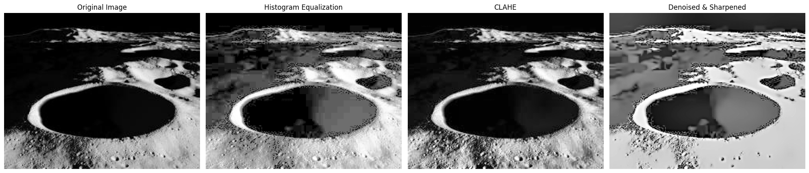

# **Enhancing Lunar Surface Images using OpenCV**

A comprehensive project focused on enhancing lunar surface images by leveraging advanced image processing techniques, including Contrast Limited Adaptive Histogram Equalization (CLAHE), denoising, sharpening, and optional neural network integration. The goal is to create high-definition, realistic visuals suitable for research, mission planning, and educational purposes.

---

## **Features**

- **CLAHE Application**: Improves local contrast and reveals hidden surface structures.
- **Denoising & Sharpening**: Reduces noise while preserving and enhancing key features like craters and ridges.
- **Realism Enhancement**: Refines textures, structures, and colors to closely match real lunar surfaces.
- **Scalability**: Designed for batch processing of large datasets of lunar images.

---

## **How It Works**

1. **Image Preprocessing**: Converts original images to grayscale for uniform processing.
2. **Contrast Enhancement (CLAHE)**: Enhances visibility in low-light regions.
3. **Noise Reduction & Texture Refinement**: Applies advanced filtering to reduce noise and sharpen key details.
4. **Optional Neural Network Integration**: Uses pre-trained models to refine image textures, fill missing data, and enhance accuracy further.
5. **Output Generation**: Produces enhanced and realistic lunar images ready for analysis.

---

## **Requirements**

- Python 3.7 or later
- Libraries:
  - OpenCV
  - NumPy
  - Matplotlib
  - scikit-image (if needed for advanced operations)

To install the dependencies, run:
```bash
pip install -r requirements.txt
```

---

## **Usage**

1. Clone the repository:
   ```bash
   git clone https://github.com/MystiFoe/Enhancing-Lunar-Surface-Images-using-OpenCV.git
   ```
2. Navigate to the repository folder:
   ```bash
   cd Enhancing-Lunar-Surface-Images-using-OpenCV
   ```
3. Open the Jupyter Notebook:
   ```bash
   jupyter notebook Enhancing_Lunar_Surface_Images_using_OpenCV.ipynb
   ```
4. Follow the step-by-step instructions in the notebook to enhance your lunar images.

---

## **Examples**

### **Before Enhancement**


### **After Enhancement**


---

## **Applications**

- **Lunar Research**: Enables detailed analysis of lunar surface features.
- **Mission Planning**: Assists in selecting landing sites and studying geological structures.
- **Education**: Provides high-quality visuals for teaching lunar exploration.

---

## **Contributing**

Contributions are welcome! Please open an issue or submit a pull request if you'd like to add features or suggest improvements.

---

## **License**

This project is licensed under the MIT License. See the `LICENSE` file for details.

---

## **Contact**

For questions or feedback, contact the repository owner at **MystiFoe**.
